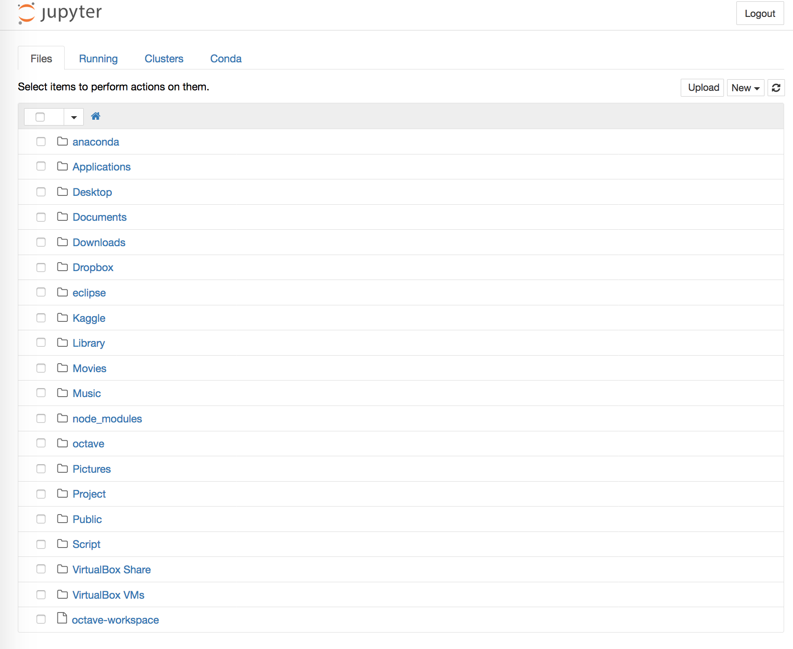
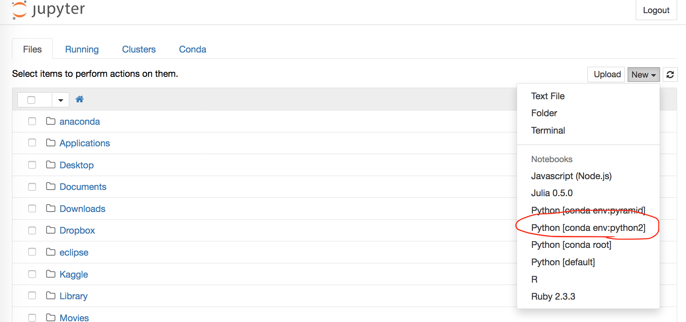

# Pythonで心理学実験・分析

## 1. 目次

(リンク先はPCから開かないとうまく表示されません)

### 1.1. 導入

PythonとPsychoPyの基本的な使い方です．

* [1.1.1. Pythonの基本](introduction/1.Pythonの基本.ipynb)
* [1.1.2. 心理学実験のための知識](introduction/2.心理学実験のための知識.ipynb)
* [1.1.3. PsychoPyの主な機能](introduction/3.PsychoPyの主な機能.ipynb)

### 1.2. 実験

Stroop課題を作ります．

* [1.2.1. 実験の下書きを作る](experiment/draft.ipynb)
* [1.2.2. 実験プログラムを清書する](experiment/main.py)

### 1.3. 分析

Stroop課題の結果 (ダミー) を分析します．

* [1.3.1. 前処理](analysis/1.前処理.ipynb)
* [1.3.2. 1要因分析](analysis/2.一致不一致の分析.ipynb)
* [1.3.3. 2要因分析](analysis/3.色別の分析.ipynb)

## 2. 事前準備

### 2.1. インストール

実験にはPsychoPy，分析にはAnacondaを使います．また，日本語利用にIPAexゴシックを用います．

PsychoPyはPython製の実験ソフトです．Anacondaは分析環境が全て整ったPythonみたいなものです (HAD付きExcelとか，PsychoToolBox付きMatlabみたいなもの)．

AnacondaはPython3版とPython2版があります．Python3版にしましょう (どっちでも問題ありませんが，今からわざわざ2系を使う積極的な理由はほぼありません)．

#### Windows

* [Portable PsychoPy](http://www.s12600.net/psy/etc/python.html)
* [Anaconda](https://www.continuum.io/downloads#windows)

#### Mac

* [PsychoPy](http://psychopy.org/installation.html)
* [Anaconda](https://www.continuum.io/downloads#osx)

#### 共通

* [IPAexフォント](http://ipafont.ipa.go.jp/node26#jp)
  * ページ下段，"IPAexゴシック"のzipファイルをダウンロードしておいてください．
  * 可能であれば，zipを展開し，中の"ipaexg.ttf"にフォントパスを通しておいてください．
    * Windows: ファイルを右クリックしたらインストールできます．
    * Mac: ファイルを~/Library/Fontsの中にコピペします．
  * このフォントは，日本語を含む刺激呈示や作図に使用します．
* [ANOVA君](http://riseki.php.xdomain.jp/index.php?ANOVA%E5%90%9B)
  * ページ中上段，"anovakun_◯◯◯.txt"をダウンロードしておいてください．
  * ANOVA君はRで分散分析をラクラク行うための関数です．
  * これがあまりに使いやすいため，今回はPythonからRを呼び出して無理やり分散分析することにします．

### 2.2. 初期設定

#### PsychoPy

PsychoPy Builderが起動するようにしておいてください．

#### Jupyter Notebook

Jupyter NotebookはPyhton/R/Julia/その他諸々の言語における分析用の開発環境で，Anacondaをインストールした時点ですでに利用可能な状態になっています．

Jupyter Notebookを起動し，ブラウザで以下のような画面が立ち上げられるようにしておいてください．「Jupyter Notebook Anaconda」で検索すると大量のチュートリアルが落ちています．



### 2.3. Jupyterの追加設定

ここから先は，可能であれば設定しておいてください．
当日インストールする時間を設けるつもりではいますが，一気に全員がやると回線が辛いかもしれないので．

WindowsユーザーはAnaconda Promptを起動してください．Macユーザーはターミナルを起動してください．

#### 2.3.1. Rとの連携

Python内部でRを実行できるようにします．
以下を実行してください．

```
conda install rpy2
```

パッケージが見つからないと言われる場合，次のように設定する必要があるかもしれません．

```
conda install -c r rpy2
```
#### 2.3.2. Python2環境の準備

Anacondaは複数の仮想環境を作成することができ，これにより，2系Pythonと3系Pythonを使い分けることができます．
2系Pythonの導入によって，Jupyter Notebook上でPsychoPyライブラリが利用できるようになります．

以下を実行します．

```
conda create -n python2 python=2 anaconda
```

その後Jupyter Notebookを起動すると，Python2が利用できるようになっています．



その後，再びターミナルに戻り，以下3行を実行してください．

```
source activate python2
pip install --upgrade pip
pip install psychopy
```
