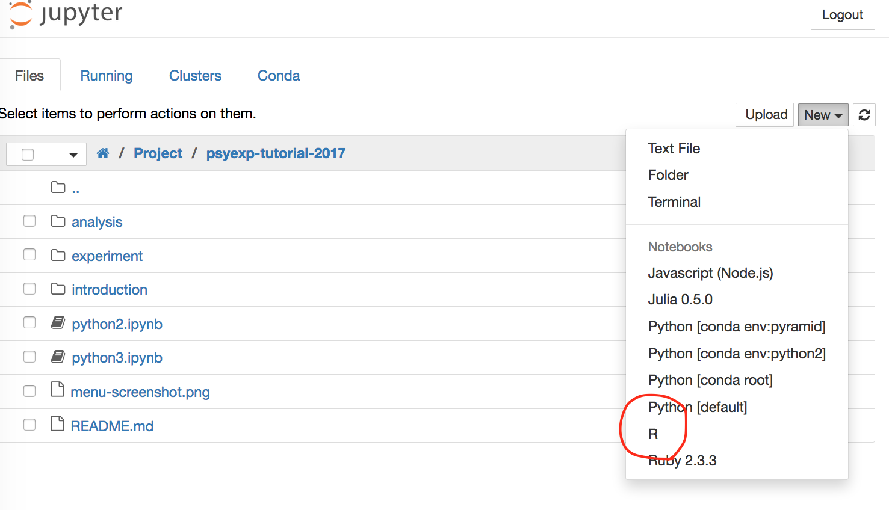

# Pythonで心理学実験・分析

心理学実験プログラム・分析スクリプトをPythonコードから作っていきます．

(2017/03/11: 「[5. 訂正](#note)」を追記しました)

## 1. 目次

### 1.1. 導入

PythonとPsychoPyの基本的な使い方です．

* [1.1.0. Pythonとは](introduction/0.Pythonとは.ipynb)
* [1.1.1. Pythonの基本](introduction/1.Pythonの基本.ipynb)
* [1.1.2. 心理学実験のための知識](introduction/2.心理学実験のための知識.ipynb)
* [1.1.3. PsychoPyの主な機能](introduction/3.PsychoPyの主な機能.ipynb)

### 1.2. 実験

Stroop課題を作ります．

* [1.2.1. 実験の下書きを作る](experiment/draft.ipynb)
* [1.2.2. 実験プログラムを清書する](experiment/main.py)

### 1.3. 分析

Stroop課題の結果 (ダミー) を分析します．

* [1.3.1. 前処理](analysis/1.前処理.ipynb)
* [1.3.2. 1要因分析](analysis/2.一致不一致の分析.ipynb)
* [1.3.3. 2要因分析](analysis/3.色別の分析.ipynb)
* [1.3.4. Rとの連携](analysis/4.Rとの連携.ipynb)

## 2. インストールするもの

### 2.1. Anaconda

**[Anaconda](https://www.continuum.io/)**をインストールしておいてください．<br>
Anacondaとは分析環境が全て整ったPythonみたいなものです．<br>
(HAD付きExcelとか，PsychToolBox付きMatlabみたいなもの)．

実験作成と分析には，Anacondaについてくる**Jupyter Notebook**という開発環境を使います．<br>

なお，AnacondaはPython2版とPython3版があります．**Python2**版にしましょう．<br>
(本当はPython3版がおすすめなのですが，2系でなければPsychoPyが動きません)

* [Anaconda for Windows](https://www.continuum.io/downloads#windows)
* [Anaconda for Mac](https://www.continuum.io/downloads#osx)

### 2.2. 日本語フォント

チュートリアルでは日本語刺激呈示のために[IPAexフォント](http://ipafont.ipa.go.jp/node26#jp)を使います．次のようにしてインストールしましょう．

* ページ下段，"IPAexゴシック"のzipファイルをダウンロードしてください．
* 次に，zipを展開し，中の"ipaexg.ttf"にフォントパスを通してください．
  * Windows: ファイルを右クリックしたらインストールできます．
  * Mac: ファイルを~/Library/Fontsの中にコピペします．

また，このフォントを作図にも使いたい場合，以下のように設定します．

* 「Anaconda2」があるディレクトリに移動します．
* 「.matplotlib」というディレクトリに移動します (なければ作ってから入ります)．
* 「matplotlibrc」というファイルを作成し，「font.family : IPAexGothic」と書き保存します．

### 2.3. ANOVA君

Pythonでは分散分析ができません．したがってRを呼び出して[ANOVA君](http://riseki.php.xdomain.jp/index.php?ANOVA%E5%90%9B)を使うのが良いと思います．

## 3. Jupyter Notebookの設定

### 3.1. 動作確認

Jupyter Notebookを起動できるかどうか確認してください．

* Windowsなら，以下の2つのいずれかの方法で起動できます．
  1. スタートメニューの中の「Jupyter Notebook」をクリックします (環境によっては落ちるかも)．
  2. スタートメニューの中の「Anaconda Navigator」を開き，「Jupyter Notebook」をクリックします．
* Macなら，以下の2つのいずれかの方法で起動できます．
  1. ターミナルを開き，「jupyter notebook」を入力します (ターミナルが使える人はこっちを使ったほうが絶対楽です)．
  2. 「Anaconda Navigator」を開き，「Jupyter Notebook」をクリックします．

うまく起動すると，ブラウザが立ち上がり，以下のような画面が表示されます．


なお，Jupyter Notebookはウイルスバスターに引っかかって起動しない場合があります．その場合，Anaconda2フォルダを監視の例外設定に追加してください．

### 3.2. 追加設定

WindowsユーザーはAnaconda Promptを起動してください．<br>
Macユーザーはターミナルを起動してください．

その後，以下を入力してください．

```
python -m ipykernel install --user
pip install pyglet psychopy
```

* 1行目はとりあえず魔法の呪文ということで．気になる人は調べてみてください．
* pipはPythonのパッケージ管理ツールです．
* PsychoPyと一緒にインストールしたPygletは，PsychoPyが裏で動かしている描画ライブラリです．
* 本当はpipより優秀なconda (下記) が推奨されますが，今回は簡単のためpipを使っています．もしこだわりがある人はpip installの1行の代わりに以下の3行をコピペしてください．

```
conda config --add channels conda-forge
conda install pyglet
conda install -c cogsci psychopy
```

## 4. Rとの連携

せっかくJupyterでRが使えるのでざっくり説明します ([参考](https://irkernel.github.io/installation/))

Rを開いて，以下を実行してください．ただし，実行前に後述の注意書きを読んで下さい．

```
install.packages(c('repr', 'IRdisplay', 'evaluate', 'crayon', 'pbdZMQ', 'devtools', 'uuid', 'digest'))
devtools::install_github('IRkernel/IRkernel')
IRkernel::installspec()
```

### 4.1. 注意点 (Windows)

1. https://cran.ism.ac.jp/ から「Download R for Windows」を開き，baseと**Rtoolsを**ダウンロードしインストールしておいてください．
2. Rは**管理者権限で開いてください**

### 4.2. 注意点 (Mac)

1. https://cran.ism.ac.jp/ から「Download R for Mac」を開き，最新のpkgをダウンロードしインストールしてください．
2. Rは**ターミナルから開いてください**，

うまくいけば，Jupyter Notebook右上「New」からRが選択できるようになっているハズです．



## 5. 訂正

<div id="note"></div>

2017/03/10時点で，1.1.2と1.2.1 (実験作成の話) の内容に誤りや複雑な文法が一部含まれていたので，少し修正しました．

### pd.Multiindexとitertools

pd.Multiindexは良いものですが，わかりにくいのでitertoolsを使って書くように訂正しました．

### iterrowsの挙動について

iterrowsは数値を参照渡しし，文字列等を値渡しするようです．ハマりどころ感漂う仕様なので，インデックスを一度reset_indexで解除してからループを回すよう訂正しました．
