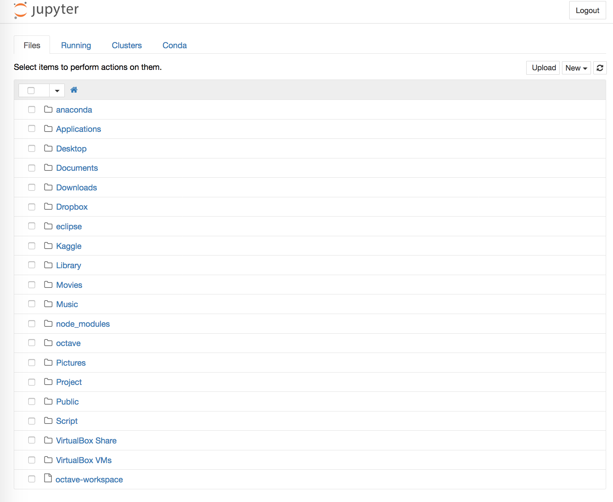

# 1. 事前準備

## 1.1. インストール

実験にはPsychoPy，分析にはAnacondaを使います．

PsychoPyはPython製の実験ソフトです．Anacondaは分析環境が全て整ったPythonみたいなものです (HAD付きExcelとか，PTB付きMatlabみたいなもの)．

### Windows

* [Portable PsychoPy](http://www.s12600.net/psy/etc/python.html)
* [Anaconda](https://www.continuum.io/downloads#windows)

### Mac

* [PsychoPy](http://psychopy.org/installation.html)
* [Anaconda](https://www.continuum.io/downloads#osx)

## 1.2. 初期設定

### PsychoPy

Builderが起動するようにしておいてください．

### Jupyter Notebook

Jupyter NotebookはAnacondaをインストールすると利用できるようになります．
Jupyter Notebookを起動し，ブラウザで以下のような画面が立ち上げられるようにしておいてください．

### JupyterとRを連携
